<!-- _class: title -->

# Hello!

My name is Nutthapat Pongtanyavichai / Leo

---

<!-- _class: very-thicc -->

# This slide is available at

<a href="https://แนะนำตัวบริคแอล.ลีโอมอเตอร์ส.ธุรกิจ.ไทย">https://แนะนำตัวบริคแอล.ลีโอมอเตอร์ส.ธุรกิจ.ไทย</a>

or <a href="https://brikl-introduction-leomotors.pages.dev">https://brikl-introduction-leomotors.pages.dev</a> 😂

---

## My Info @ Brikl

- Jr. Software Engineer (Frontend Storefront)
- Part Time 💹
- Going to move to Platform next year
- Been here since 1 September but just got my chance to introduce myself

---

## My Info

- 🎂 18 Years Old
- 🏠 Lives in Bangkok / Samut Prakan
- 🥗 First Year Student at Chulalongkorn University in Computer Engineering (CP49 / Intania 106)
- FYI I was Triam Udom Student and Assumption College Student

🥐

---

## My Preferences

- 🍙 **Food**: Salmon Sashimi please (actually can eat anything)
- 🧑‍💻 **Hobbies**: Programming, Contribute OSS, Participate in Community Events, Useless Application
- 🎮 **Games**: Rythm Games, Minecraft, Microsoft Flight Simulator, Meme Games (ex: MUCK)
- 🎧 **Music**: Anime, J-Pop, Meme
- ▶️ **Media**: Anime ([My Anime List](https://myanimelist.net/profile/Leomotors))
- 🔗 **Link Tree**: https://leomotors.me

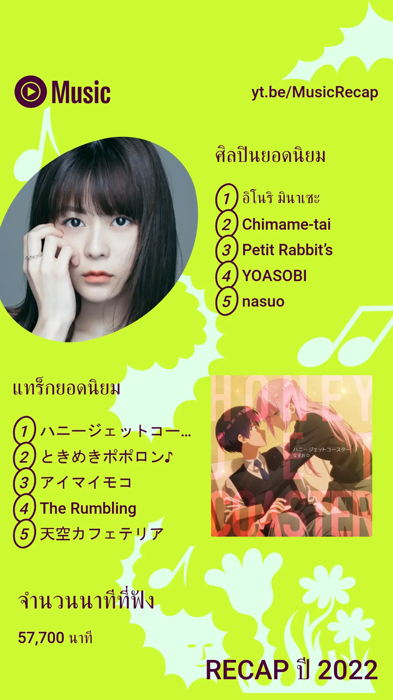

---

## Rythm Games

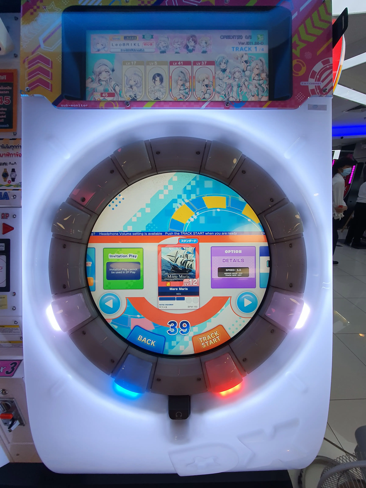

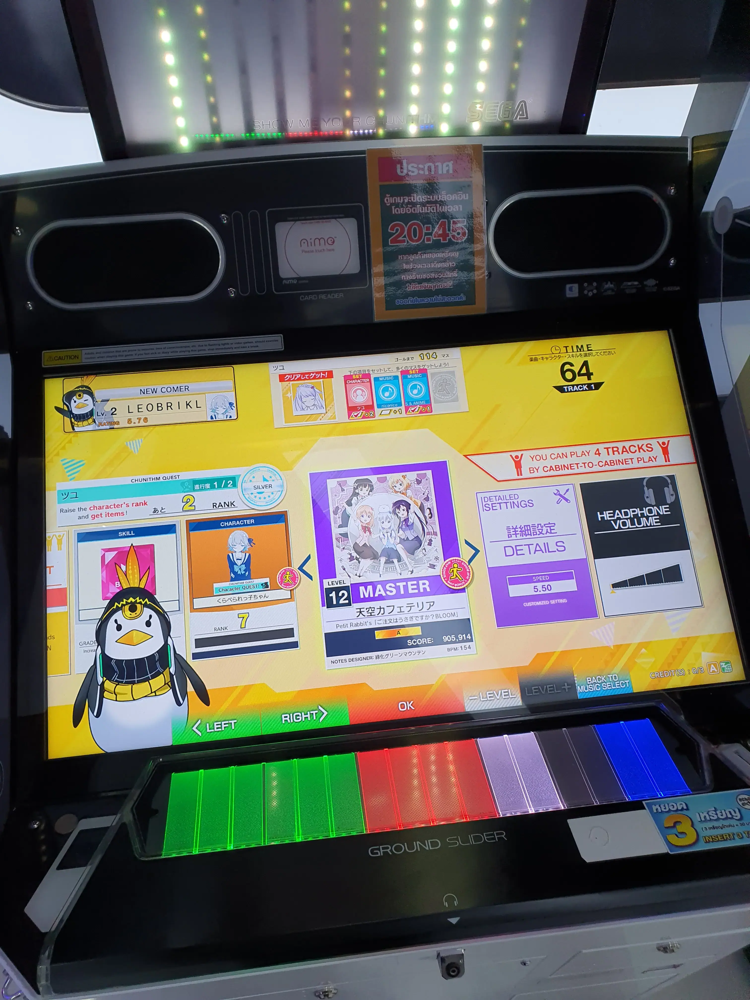

---

## Events

- Love participating in these events
- Past Events are ๖th Stupid Hackathon in Thailand, Code Golf Party (covid cluster lmao)
- **Fun Fact**: I have made a short presentation in this event (Hacktoberfest) too!
- Help organize events, now member of Creatorsgarten

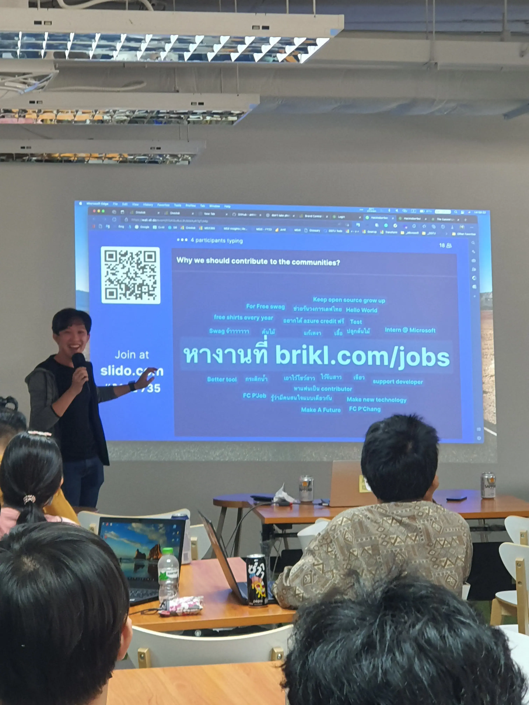

---

## DevMountain

- Another wonderful event sponsored by Brikl

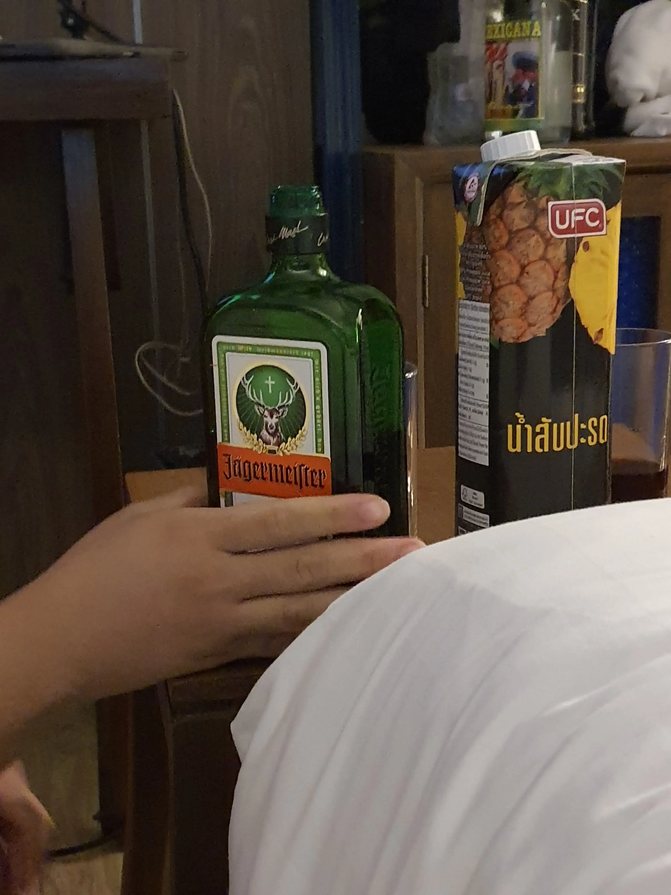

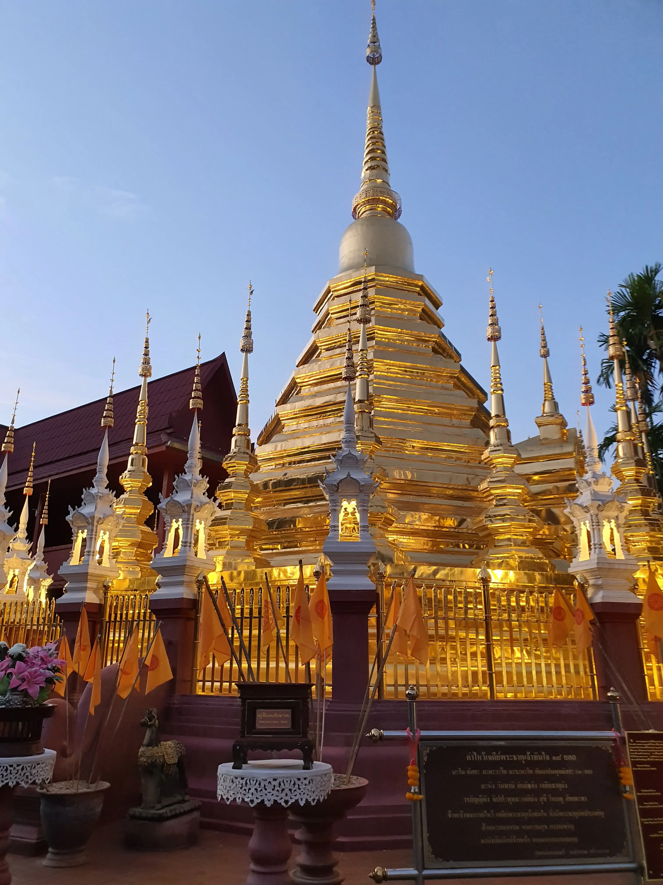

---

## My Contribution to BRIKL

Promote BRIKL in every way possible

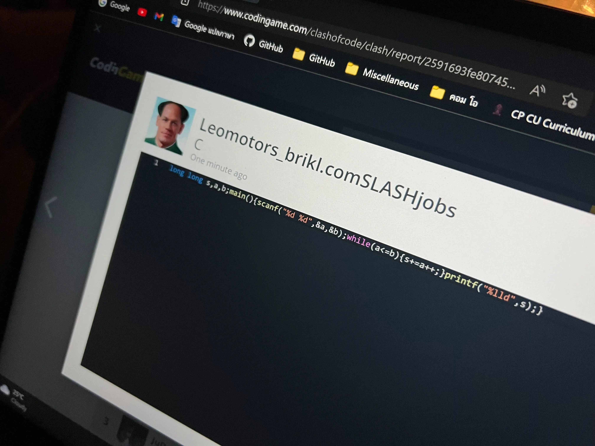

---

## My Contribution to BRIKL

Promote BRIKL in every way possible

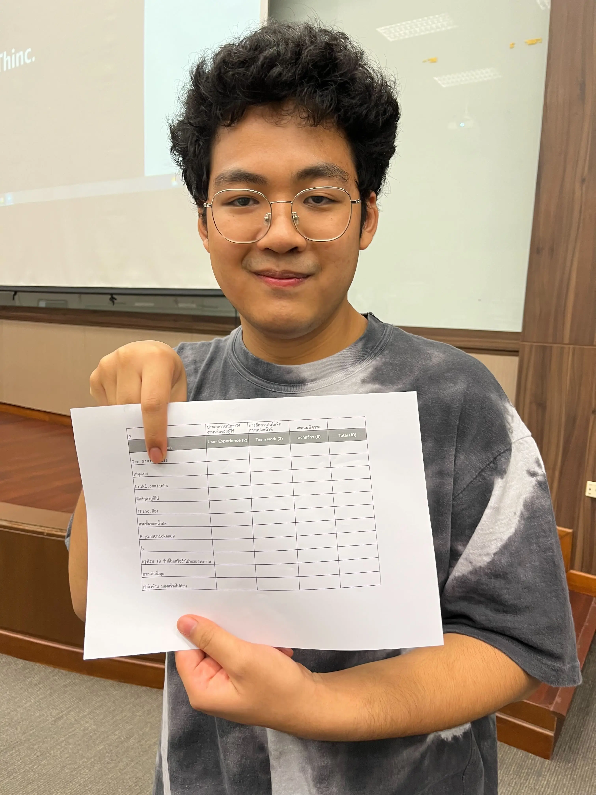

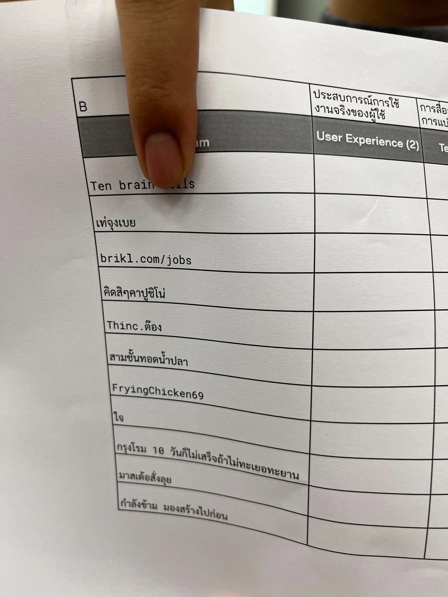

---

## My Contribution to BRIKL

Emoji Engineer

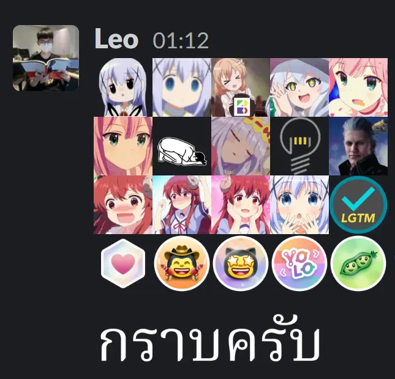

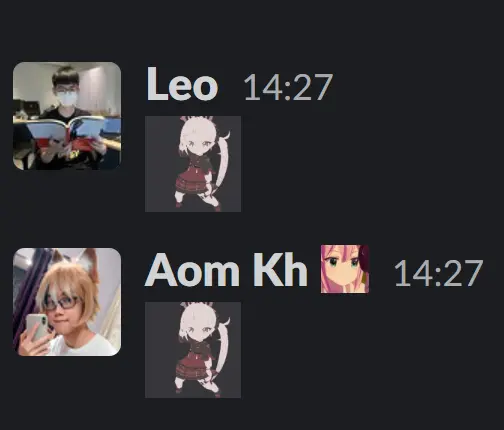

